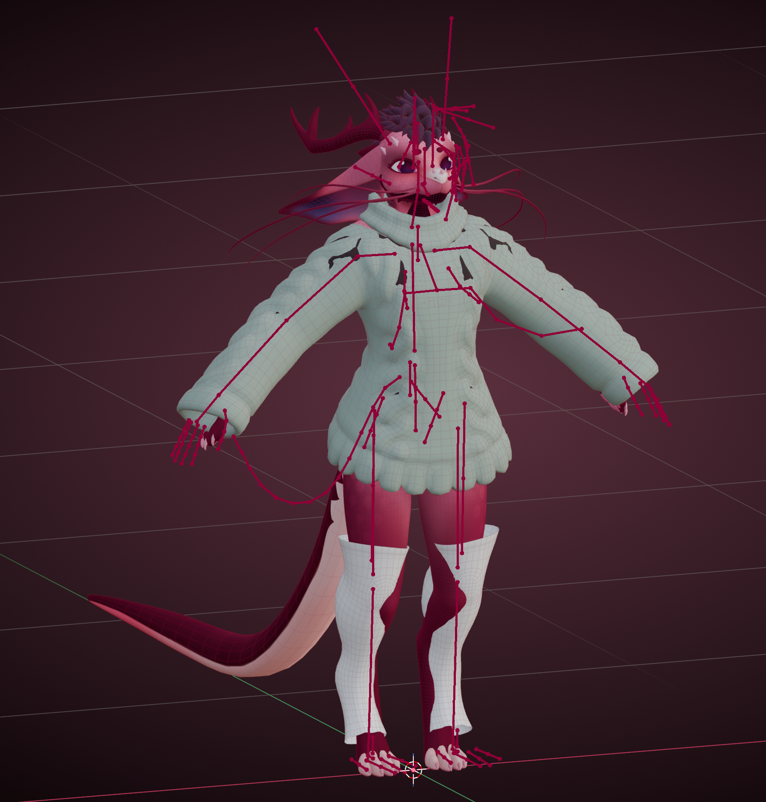
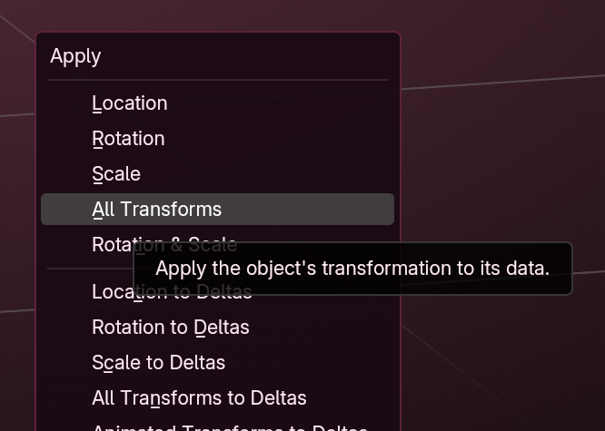
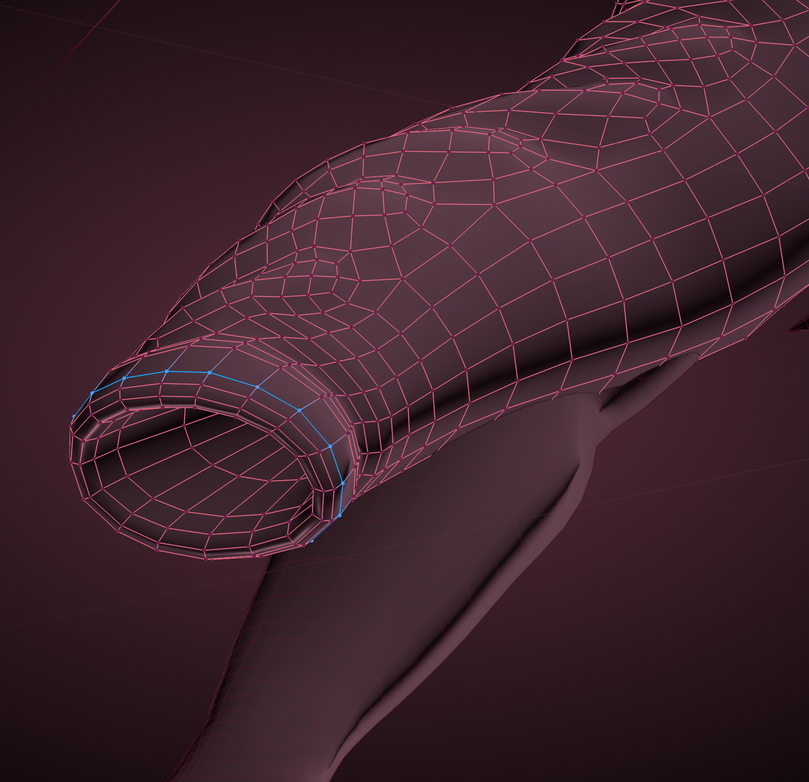
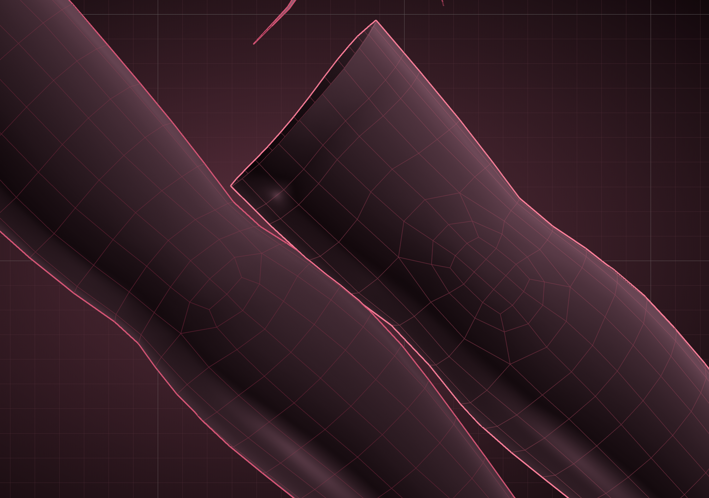
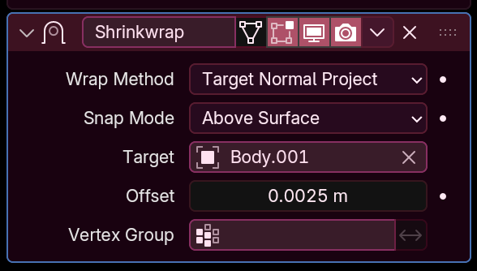
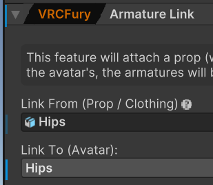
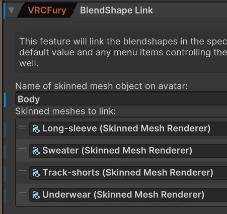

*Why doesnt my outfit work?*

Hello! If you stumbled your way here, you're a bit early! I haven't finished writing this yet. Come back later when I have something to show!

Also, psst, I'll be making a YouTube tutorial on this too x

That being said though, enjoy what I have so far \o/

### Disclaimer: Some of this is just personal notes right now, apologies for anything that's unclear haha

With VRChat models becoming more diverse and popular to create from scratch, it creates a lot of market for clothing makers. People making comfy outfits, unique fashion ideas, or ways for groups and communities to express themselves. Most of the time, clothing options are tailored to a specific (popular) avatar, but there could be demand to add it to another popular base. What happens if you use a niche model that you know wouldn't be supported? This is what I hope my guide can help with!

  
<strong>Method 1 - Proportional Editing</strong>

  
<strong>1. Model Setup</strong>

#### 1. Model Setup

  In your project, add in the avatar model you'd like to fit your clothing onto, and then the clothing you want. Then, selecting the clothing's armature, align your clothing to "best-fit" the model, moving/rotating/scaling it to fit nicely on the shoulders and feet as best as you can. It won't be perfect, but we're looking for good, not perfect (yet!). 

  

  There is a chance that the clothing is posed differently from your target avatar (eg. clothing is in A-pose and model is in T-pose). For this, (...) (pose mode > armature modifier save as shapekey > apply pose as rest pose > apply to basis) [image NEEDED]

  Once best-fit, you can select the armature, hit `Ctrl + A`, and apply all transforms.

  

  After that's done, you can delete the old clothing armature.

Depending on your clothing of choice, you can now move on to **either** step 2 or 3. Both steps require knowledge of [**proportional editing**](https://hantnor.github.io/HanDocs/docs/Face%20Tracking/Advanced/Blendshape%20Creation#2-blendshape-creation).

  
<strong>2. Loose-fit Refit</strong>

#### 2. Loose-fit Refit

  If your clothing is loose-fit (sweater, pants, shoes, etc), this step is for you! If it is skin-tight, please skip to step 3.

  

  If your model is symmetrical, make sure to clean it up! See [**this step**](https://hantnor.github.io/HanDocs/docs/Face%20Tracking/Advanced/Blendshape%20Creation#1-model-cleanup) for more details.

  As for fitting, you can use proportional editing to fix any clipping, shape, or limb proportion changes. This now comes down to artist's eye, so no concrete advice can be given. Imagine you're wearing it!

  

  For very loose clothing, you have the liberty to add some "wiggle-room" between the clothing and body mesh to account for clipping. Use this to your advantage!

  

  
<strong>3. Skin-tight Refit</strong>

#### 3. Skin-tight Refit

  If your clothing is skin-tight (leggings/tights, fishnets, latex, spidey-suit), this step is for you! If it is loose-fit, please head back to step 2.

  

  If your model is symmetrical, make sure to clean it up! See [**this step**](https://hantnor.github.io/HanDocs/docs/Face%20Tracking/Advanced/Blendshape%20Creation#1-model-cleanup) for more details.

  Some important landmarks to be noted are areas of high deformation (elbows, knees). These areas may have denser topology, and should be matched up with the base model. It'll help prevent further clipping!

  

  

  The key to making skin-tight clothing work, is to have it fit closely and uniformly around the body. This can thankfully be done with the built-in **Shrinkwrap** modifier! Add this onto the clothing mesh with the wrench icon, and match these initial settings. You can adjust the offset if necessary.

  

  You can continue editing the mesh like this! I sometimes go into Sculpt Mode and use the Surface Smooth tool to even out crinkly topology.

  

  Once at a point you like, apply as a shapekey, and apply it to basis.

  
  

  

  
<strong>4. Weight Painting</strong>

#### 4. Weight Painting

  One of the most important steps! 

  If your model has loose parts (extra fluff, cloaws, piercings, body parts that might get in the way (eg. a disconnected tail when prepping for pants)), remove these on a duplicate. Your model should look like similar to this!

  

  :::caution

  Make sure you are doing this on a duplicate of the mesh! `Shift + D` before making your changes. (You should be doing your changes on a mesh similarly named `Body.001`.)

  :::

  

  To automate most of the process of weight painting, I use an add-on called [**Robust Weight Transfer**](https://jinxxy.com/SentFromSpaceVR/robust-weight-transfer), and match these settings while selecting the clothing mesh.

  

  After this, assign the base model's armature to the Armature modifier in the clothing mesh.

  Always be sure to double-check the quality of the weight painting with **Pose Mode**. If there are weights that look wrong, you can adjust this manually.

  
<strong>5. Blendshape Transfer</strong>

#### 5. Blendshape Transfer

  For blendshapes, I use a tool called [**Mesh Data Transfer**](https://mmemoli.gumroad.com/l/tOKEh). This is much simpler to get going than RWT! While selecting the clothing mesh, I match these settings:

  

  And the body mesh has only the selected (body-modifier) shapes enabled. For more detailed instructions on how to use Mesh Data Transfer, see [here](https://hantnor.github.io/HanDocs/docs/Face%20Tracking/Advanced/Mesh%20Data%20Transfer/)!

  After steps 4 and 5 are done, you can delete the duplicate (`Body.001`) mesh.

  
<strong>Method 2 - Vulpes's Tailoring Tool</strong>

I do not know how this works fully yet, will get Vulpes's input or just use his tutorial video (if he has one?)

  

After either method is completed, you can then export the clothing to Unity. For a more in-depth explanation on this, see the **Exporting** section [here](https://hantnor.github.io/HanDocs/docs/Face%20Tracking/Advanced/Blendshape%20Creation#exporting).

Be sure to export just the original armature and the clothing mesh(es). No body mesh! Save it under a separate name.

  
<strong>Unity Setup</strong>

  After exporting the clothing to Unity, add the FBX under the root (name) of your avatar, and add a couple components to it. 

  #### Armature Link - VRCFury 
  
  

  #### Blendshape Link - VRCFury 
  
  

  If wanted, you can add toggles for individual parts of the outfit. You can do this manually, or with VRCFury's **Toggle** component.

You're done! Enjoy your new fit \o/