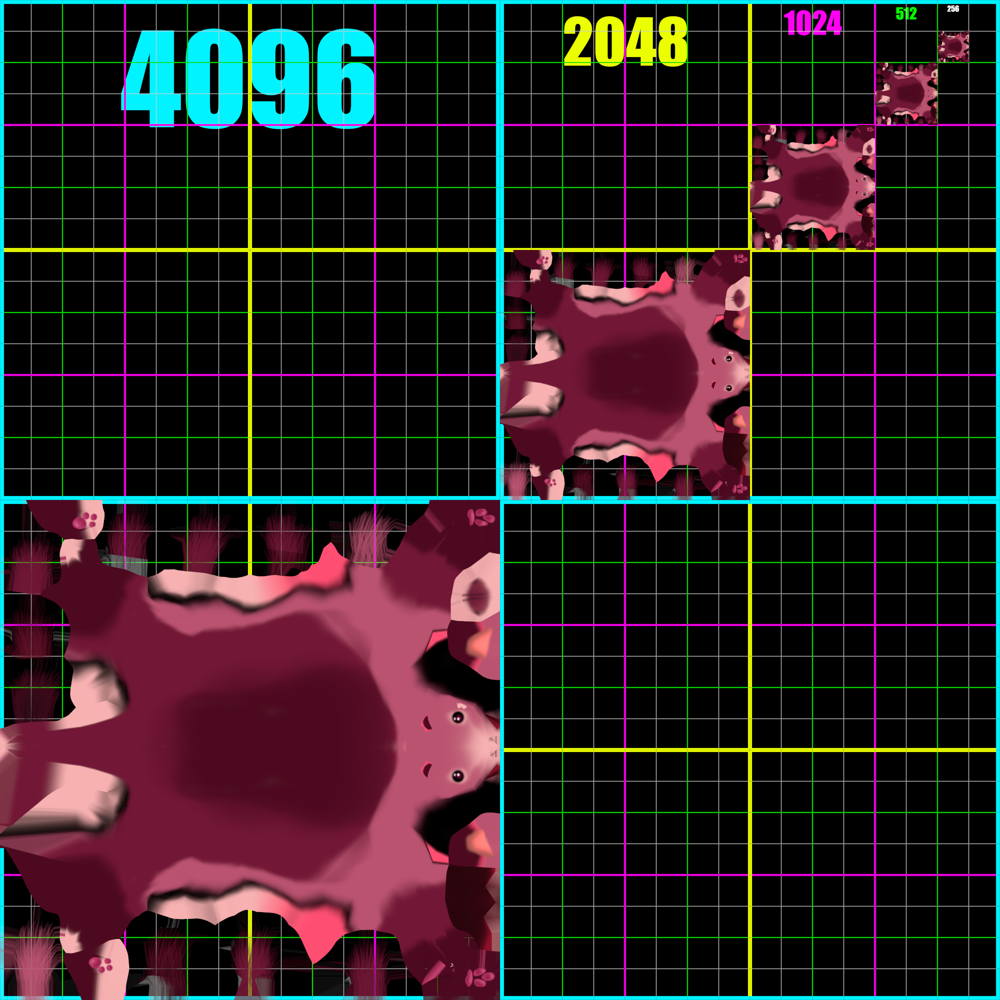

*Textures are an essential part of what makes or breaks an avatar. They can be realistic, toony, or somewhere in between. With this in mind, let's make these perform well!*

For optimizing video memory (VRAM), it is important to remember that your texture size contributes to your avatars overall **VRAM** usage. The more you limit the impact of these, the lighter of a load your avatar will have on other users. This will lead to smaller download sizes, and happier players!

## Resolution

*Wow, 4K textures look so detailed! I should put these on everything...*

While high-resolution textures may look captivating, performance does take an equal cost. Larger textures mean larger download sizes, and larger cost to performance. 

Every time you increase the resolution by **one** step, it **quadruples** your memory taken up!

It's important to find a balance between **quality** and **performance**. If you'd like the best tradeoff, use the **1-Meter Rule**. 

- Look at your avatar from **one meter** (3 feet) away. From the original texture's resolution, start decreasing the quality. As soon as you start seeing a significant loss in detail, stop. That's the highest quality you need!
    - For finer details (typically seen on 4K textures), you will not be able to notice these unless you are **8 inches** away from your avatar. *In most cases, you will not need 4K textures.*

(Image comparison of resolutions, BC5 compression at 4k, 2k, 1k, and 512)

## Compression

Compression methods are a way to shorten the amount of data in an image. In all cases, compression is **lossy**, meaning that you will almost always lose a small amount of data in your original image.

1. If a texture **doesn't** have __color gradients__ or __alpha transparency__, it should be set to `Normal Quality - DXT1/BC1`.
    - `High Quality` will add an alpha channel even though the texture doesn't have/need one, increasing VRAM usage.
    - If a texture has an alpha channel but doesn't need one, Unity will automatically use `DXT5`. You'll need to override it to be `DXT1/BC1`.
        - *DEV NOTE: Unity 2022 has combined DXT and BC together in some places.*

2. If the texture **has** color gradients or alpha transparency, use `High Quality - BC7`.
    - If Unity is automatically choosing `DXT5`, use the PC override to set it to `BC7`. `DXT5` uses the same VRAM but has more JPEG-like compression artifacts.

3. Normal Maps should be PC overridden to use `BC5`.
    - Normal Maps only use the **Red** and **Green** color channels, and BC5 is optimized for textures that use those specifically.

4. Grayscale images that are entirely black, white, and gray (like masks and AO Maps) can be set to `Texture Type - Single Channel`, `Channel - Red`, `High Quality - BC4`.
    - Alternatively, you can use PC Override to set it to `BC4`.
    - For **strictly black-or-white** masks, you can set these to a texture resolution of 512 or even 256!

### Crunch Compression 

If you need it for reducing download size, you can utilize **crunch compression**. This makes a visibly "crunchy" texture at the tradeoff of file sizes. This isn't recommended if the quality of your textures is important. *This will **not** help your VRAM usage.*

(comparison image here, BC5 compared to DXT-1 at 100, 50, 25, and 0)

- For **opaque albedo** textures, use **RGB Crunched DXT-1**.
- For **transparent albedo** and normal map textures, use **RGBA Crunched DXT-5**.

## Extra Tools

Using extra tools in your project may help streamline your texture optimization process! My recommendation is [**Thry's Avatar Performance Tools**](https://github.com/Thryrallo/VRC-Avatar-Performance-Tools/). You can see what compression method and resolution are being used by every texture!

- This avatar has **35** textures, and only takes up **66MB** of VRAM.
    - *Example avatar courtesy of [Beanthusiast](https://linktr.ee/beanthusiast)!*

Everything is neatly listed in order of most VRAM impact to least.

This tool will also suggest optimizations! It can take care of both **resolution** and **compression methods**.