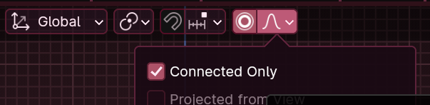
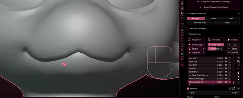
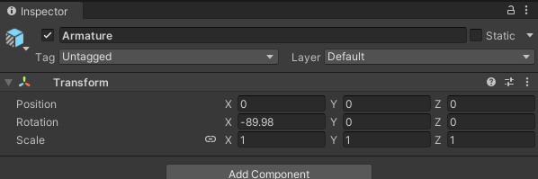

*Note: This page is a WIP! Instructions here are subject to change. Use at your own risk.*

**Disclaimer:** Blender knowledge is **required** to create blendshapes for your model from scratch. If you do not know Blender, this guide will not help you.

## Recommended Blender Addons

- [**Shape Key Manager Pro**](https://blendermarket.com/products/shape-key-manager-pro)
  - This addon can duplicate, rename, and mirror blendshapes you create. It saves you having to do most of the tedious work!
- [**Shape Keys Plus**](https://github.com/MichaelGlenMontague/shape_keys_plus/releases/tag/v2.0)
  - This addon is a better blendshape manager that lets you easily reorder, mirror, and sort your blendshapes.
- [**VRCFT-OSC-Receiver**](https://github.com/benaclejames/VRCFT-OSC-Receiver)
  - You can test blendshapes you make in Blender directly, without having to export your model to Unity. This is useful for testing purposes.

### Project Setup

In your project, make sure you have the following:

- A model of choice to add FT to
- Any addons you may want/need
- Patience (optional)

  
<strong>Method 1 - Proportional Editing</strong>

  
<strong>1. Model Cleanup</strong>

#### 1. Model Cleanup

- **Make sure your model is symmetrical.** In **Edit Mode**, enable **X-Mirror** in the upper-right of your viewport.
- Use `G` (the shortcut for the Grab/Move tool) to move the mesh. The mesh should move symmetrically and not have any stray vertices splitting from either side. If you notice stray vertices moving independently, you can use the **Snap to Symmetry** tool to symmetrize each side.
- Ensure all blendshapes are disabled when checking for symmetry to avoid misleading deformations.

***If your model cannot be symmetrized, use Method 2.***

---

  
<strong>2. Blendshape Creation</strong>

#### 2. Blendshape Creation

Refer to the [Unified Expressions References](https://docs.vrcft.io/docs/tutorial-avatars/tutorial-avatars-extras/unified-blendshapes#ue-base-shapes) for detailed guidelines on the facial expressions you need to create. Start creating each shape, forgoing any changes to the eyeball rotation. Eye rotation is managed by the **VRC Face Tracking (VRCFT)** rotation driver, so you don't need to adjust eyeball rotation unless your model lacks eye bones.

- **Blendshape Workflow**
  1. Click the **+** button next to the blendshape list to add a new blendshape.
  2. Press `O` on your keyboard to turn on proportional editing, or click the **Proportional Editing** icon at the top of the viewport.
  
  
  
     - **Tip:** Enable **Connected Only** in the proportional editing options to affect only connected vertices.
  3. **Select the vertices you want to modify.** You can use tools like **Box Select (`B`)** or **Circle Select (`C`)** for efficiency.
  4. Press `G` to move (grab) the vertices, `R` to rotate them, or `S` to scale them as needed.
  5. **Use your mouse scroll wheel to adjust the influence radius of proportional editing.** Scrolling up decreases the area, while scrolling down increases it.
  
  

##### Additional Tips

- **Preventing Unwanted Influence**
  - To prevent certain faces or vertices from being influenced, you can hide them:
    - Press `H` to hide selected faces or vertices.
    - Press `Alt + H` to unhide them.
    
    

- **Axis Constraints**
  - To move or rotate along a specific axis, use these shortcuts:
    - After initiating a move, rotate, or scale action, press `X`, `Y`, or `Z` to lock the transformation to the corresponding axis.
    - Hold `Shift + X`, `Shift + Y`, or `Shift + Z` to exclude an axis, restricting the transformation to the other two axes.
    
    

---

  
<strong>3. Creating Combined Shapes</strong>

#### 3. Creating Combined Shapes

Some facial expressions require combined shapes to function correctly. For example, you may need a **BrowInnerUp** blendshape that affects both eyebrows symmetrically by combining **BrowInnerUpRight** and **BrowInnerUpLeft**.

Since you've already created all the uncombined (left and right) shapes, we can use these to make combined variants using **New Shape From Mix**:

1. **Set Blendshape Values in Object Mode**

   - Switch to **Object Mode**.
   - In the **Shape Keys** panel, set the values of both **BrowInnerUpRight** and **BrowInnerUpLeft** to **1.0**, activating both needed shapes.

2. **Create a New Shape from the Mix**

   - Click on the **Shape Keys** dropdown menu (the down arrow icon) in the **Shape Keys** panel.
   - Select **"New Shape From Mix"**. This action creates a new blendshape that combines the current state of all active blendshapes.

3. **Rename the New Blendshape**

   - The new blendshape will appear in the list, usually named something like **Key N**.
   - Rename this new blendshape to **BrowInnerUp** (or the appropriate combined shape name).

4. **Reset Original Blendshape Values**

   - Set the values of **BrowInnerUpRight** and **BrowInnerUpLeft** back to **0.0** to avoid unintended deformations when manipulating other blendshapes.

5. **Test the Combined Blendshape**

   - Move the slider of the new **BrowInnerUp** blendshape from **0.0** to **1.0**.
   - Verify that both eyebrows move up symmetrically as intended.

  - You can use this same method to create other combined blendshapes, such as **EyeClosed**, **MouthSmile**, etc.

---

  
<strong>Method 2 - Sculpt Mode</strong>

To be addressed.

---

## Exporting

Some model creators may have different preference on how large the bones are, called **export scale**. This can be one of two possibilities:

**All Local**: The default Blender setting. Bones are scaled by a factor of 100.

**FBX Units Scale**: An alternate setting for exports. Bones are scaled by a factor of 1, easier for creating and managing physbones.

### How can I tell what the model creator used?

Typically, you can refer to a physbone radius to see what the scaling is set to. If a physbone is set to have many leasind 0's (eg. `0.0025`), then this is **All Local** since the physbones are being scaled down by a factor of 100. This isn't present in models with **FBX Units Scale** (eg. `0.25`).

Alternatively, you can check the `Armature` scale if it's at 1 or 100. 1 for **FBX Units Scale**, and 100 for **All Local**.

Credit: Nicoreda

---

## Testing Your Blendshapes

After creating your blendshapes, it's always important to test them to make sure they work as you expect. You can test with an upload to VRChat, but there are a couple of other alternatives if you prefer to test locally. \o/

  
<strong>Option 1: Testing in Blender using VRCFT-OSC-Receiver</strong>

This method allows you to test your blendshapes directly in Blender without exporting your model to Unity.

1. **Ensure VRCFT-OSC-Receiver Addon is Installed**

   - Install the [VRCFT-OSC-Receiver](https://github.com/benaclejames/VRCFT-OSC-Receiver) addon in Blender if you haven't already.

2. **Open VRC Face Tracking (VRCFT)**

   - Make sure VRCFT software is running and properly tracking your facial expressions. I usually use LiveLink for iOS, but you can use MeowFace for Android!

3. **Enable the Receiver in Blender**

   - In Blender, select your model's body mesh.
   - Navigate to the **VRCFT Receiver** panel in the Properties window.
   - Click **Start Receiver** to begin receiving OSC data from VRCFT.

You should be able to oogle at the camera and check to see if there's any changes you need to make. If some combined and split blendshapes for the same action trigger (eg. LipFunnelUpper and Lipfunnel are activating, creating something way too exaggerated), you can hide the specific shapes with the eyeball icon. In Unity, they will act properly!

  
<strong>Option 2: Testing in Unity with Gesture Manager and Av3Emulator</strong>

This method involves exporting your model to Unity and testing the blendshapes within the Unity environment.

1. **Export Your Model from Blender**

   - Export your model as an **FBX** file with shape keys (blendshapes) included.
      - **Create a backup of your FBX file in Unity before making changes.**

2. **Import Your Model into Unity**

   - Open your Unity project for VRChat avatar development.
   - Import your FBX into the folder where it's normally stored.

3. **Install Gesture Manager and Av3Emulator**

   - Import both [Gesture Manager](https://github.com/BlackStartx/VRC-Gesture-Manager) and [Av3Emulator](https://github.com/lyuma/Av3Emulator) and into your Unity project.

4. **Open VRC Face Tracking (VRCFT)**

   - Ensure VRCFT software is running and properly tracking your facial expressions.

5. **Test Through the Expressions Wheel**

   - Enable both Eye and Face Tracking through the wheel as if you were in game, and oogle at the screen! If there's anything you noticed that doesn't quite add up, you can make changes in Blender and re-export.

---
