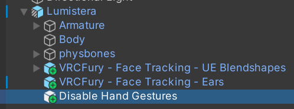

# Ears? Tails? Gestures?

***Note: This page is a WIP! Instructions here are subject to change. Use at your own risk.***

*What do you mean, I can have my ears move when I smile?!*

## Intro

This is a comprehensive guide on how to add integration with your avatar's ears, tail, tongue, or any extra tidbits of your model to work with your face tracking! This **does** require basic/intermediate Unity knowledge to conduct, so buckle up!

## Ear Tracking

Ear tracking is much simpler than most people think! It takes just a few animations to get up and running - works like a charm!

This can also be used to animate other parts, but ears are the most common.

### 1. Dependencies
You will need to have a few packages in your project in order for this to function properly. Grab the latest versions of:
- [**VRCFury**](vcc://vpm/addRepo?url=https%3A%2F%2Fvcc.vrcfury.com)
- [**VRCFT - Jerry's Templates**](https://adjerry91.github.io/VRCFaceTracking-Templates/)
- [**Adjerry91's Ear Tracking Package**](https://cdn.discordapp.com/attachments/1182444014113402921/1287465659185500231/FaceTrackingExtra_v1.3.unitypackage?ex=670025d5&is=66fed455&hm=5c87c50b1ccb9b54c6655186cfe46eeb5b1d512800e1710855dfd09651c319ec&)

Import these into your project and ensure your avatar is set up with FT before moving on.

### 2. Animations

After importing the Ear Tracking package into your project, you should find a folder in your Assets called **Face Tracking Extra**. In here, navigate to **Ear Movement**, and you'll find six animation files, a VRCFury prefab, an FX layer, and some other dependencies. 

Drag the FX layer (`FX - Face Tracking - Ear`) into your avatar's **Animator** for easy testing.

In your **Animation** tab, you'll see a list of the six animation files you saw earlier - three for your left ear, and three for your right. 

Select one of these animations and hit the **Record** () icon. This will prepare your avatar to be posed for the animation! Move your avatar's ears **Up**, **Down**, or **Rest** for each animation. Repeat this for each side.

### 3. Installation

Once all the animations are done, you can remove the FX layer from the Animator, and place the VRCFury prefab (`VRCFury - Face Tracking - Ears`) onto your avatar. This will add a toggle in your menu and do the heavy-lifting for your ears to move properly.

### It's now ready to upload! 

## Gesture Lock

### This may be deprecated in the future. Use this for avatars released/updated before October 10, 2024[^1].

Gesture Lock allows you to lock certain gestures or expressions, preventing them from being overridden by other animations or face tracking inputs. This is useful for maintaining specific poses or actions during your VRChat experience.

### 1. Dependencies

You will need to have a couple of packages in your project in order for this to function properly. Grab the latest versions of:
- [**VRCFury**](vcc://vpm/addRepo?url=https%3A%2F%2Fvcc.vrcfury.com)
- [**VRCFT - Jerry's Templates**](https://adjerry91.github.io/VRCFaceTracking-Templates/)
- [**Han's Creations - Gesture Lock**](https://cdn.discordapp.com/attachments/1251803392548929546/1291642904938545253/hantnor_-_VRCFT_Gesture_Lock.unitypackage?ex=6700d7b2&is=66ff8632&hm=8a9acf833aaff3b0b369fbaf4e8b484a672f6342a8f14ee92c85ae836f5cafdc&)

Import these into your project and ensure your avatar is set up with FT before moving on.

### 2. Prefab Edits

In the **Face Tracking - UE Blendshapes** prefab in your heirarchy, you should find a few sections of components. Double-click on the **Menu** field and remove the `Disable Hand Gestures` toggle from the menu.

After this is done, navigate to **Han's Creations -> FT Gesture Locker** and add the included prefab to your avatar's heirarchy.

 

### You're done!

[^1]: This is a projected date. Adjerry is planning on adding this as an integrated feature. For avatars that do not have the VRCFury scripts packed, it may prove difficult to update, and may inhibit the update. Will update as news comes out.

<!-- Uncomment below if the VRCFury setup proves to be buggy. -->
<!-- 

Manual Setup

This setup will be a bit more, well, manual. Intermediate Unity skills will be needed to conduct this, but is much more **customizable**. If functionality of other assets are not needed, head to the **VRCFury Setup** section!

### 1. Dependencies

You will need to have a couple of packages in your project in order for this to function properly. Grab the latest versions of:
- [**VRCFury**](vcc://vpm/addRepo?url=https%3A%2F%2Fvcc.vrcfury.com)
- [**VRCFT - Jerry's Templates**](https://adjerry91.github.io/VRCFaceTracking-Templates/)

Import these into your project and ensure your avatar is set up with FT before moving on.

### 2. FX Layer

If your avatar is set up completely, it should come with an FX layer. This can be found in the **Avatar Descriptor**. Double-click this!

[image]

Head to the **Parameters** section and add a new Bool called `FacialExpressionsDisabled`.

[image]

In your Animator section, your avatar should have two[^2] layers that control your avatar's expressions with gestures. Look for layers labeled **Left Hand** and **Right Hand**.

[image]

Each arrow leading to all of the states are what we're going to be focusing on. Select one, and add a new condition by hitting the **+** icon. This condition will only activate when `FacialExpressionsDisabled` is set to **False**.

[image]

Repeat this step for every transition from an idle state to a gesture state. That can be tedious.

### You are done!

[^2]: This can vary. Hobbert's avatars are usually split into **Eyes** and **Mouth** layers. It's also possible for avatars to be set up with gestures all condensed into one giant layer.  -->