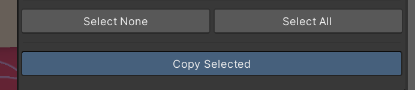

# Hotswapping

*I need to replace my FBX quickly, but how?*

Hotswapping is useful for anyone wanting to quickly and seamlessly overwrite a file in a project. **NOTE: This is a destructive process. Always make a backup of the original file in case something goes wrong.**

This guide will describe replacing an FBX file. This can also work for any other type of file, but FBX is the most common for this approach.

## 1. FBX Location & Prep

In your project, you will have a folder or some directory designated for your original FBX file. It may be in the creator's root folder, or under a folder called `Models`.

In here, you should find an FBX file represented something like this! If it does not have a preview, chances are, it may not be an FBX file. Look elsewhere!

**At this stage, please duplicate your model!** You always want to keep a backup of your file to revert in case of any unforseen circumstances. The duplicate will be marked with a `1` at the end of the name.

## 2. File Explorer

With the original file, **right-click** and select `Show in Explorer`. File explorer is the name for your Windows file searching system. It's marked with a yellow folder in a blue holder!

When this is clicked, a new folder should appear with your original file, your backup, along with a couple `.meta` files for each.

Now you can open a new window of File Explorer by pressing `Windows + E`. The new window should be used to route to your new FBX you'd like to overwrite with. This requires manual input.

**At this stage, rename the new file to exactly match the name of the old file.** Any differences, and the file won't be overwritten. You'll need to reimport it with the correct name.

Drag and drop the new file into the model directory. IF this doesn't let you copy the file over, you can always hit `Ctrl + C` and `Ctrl + V`.

If named correctly, you'll be given a confirmation prompt asking if you'd like to replace the existing file. Select **Replace the file in the destination**, and wait for the process to complete.

**You're done! Make sure to keep that backup on-hand, you'll never know when you may need it!**

*If you followed this guide to hotswap an FT-compatible model, you can head to step 3 of [this guide](https://hantnor.github.io/HanDocs/docs/Face%20Tracking/Beginner/PatchGuide/#3-add-the-fx) to finish setup.*

## Pumkin's Avatar Tools

    
Did your model disappear?

If your model (or other clothing) suddenly disappears from view, or Unity renders your blendshapes incorrectly, this is a seemingly regular thing that occurs.

It's not pinned down exactly what causes this, but it could be an incongruency of Blender versions between the model creator and yourself. There is a way to fix this in Unity.

### Dependencies

    You just need [**Pumkin's Avatar Tools**](https://rurre.github.io/vpm/) (yes, there is no second "p" in the name), and you should be good to go.

Drag the FBX file directly into the hierarchy. This may appear with incorrect shading, or have a lack of materials. This is normal.

With **Pumkin's Avatar Tools** in your project, navigate to `Tools -> Pumkin -> Avatar Tools`.

While selecting the newly-imported FBX in the hierarchy, head to the Avatar Tools window, and select **Select from Scene** at the top.

Scroll down to **Copy Components**, and while selecting the original (broken) avatar, hit its **Select from Scene** button.

If the materials are broken, ensure you select the **Skinned Mesh Renderers -> Materials** checkbox here:

Scroll down to the bottom of the page and select **Copy Selected**.

This should be good to go! If there existed any VRCFury components on the root of the model, you may need to double-check to make sure they copied over successfully.

