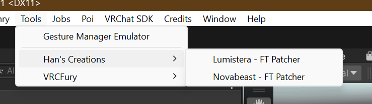
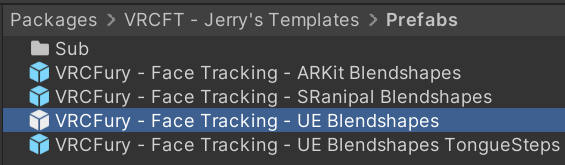

# How to patch!

### 1. Import the FT DLC Unity package downloaded from Gumroad.
- There will also be a **ReadMe** file in the download that you may want to read!

### 2. Patch!
- If importing was successful, a window *should* appear automatically. If not, you can route to **Tools -> Han's Creations -> (Model Name) - FT Patcher**.

- Into the **(Model) FBX** slot, you can input your unedited FBX here! The patcher will most likely specify what model to put in, and have a model thrown in already. In most cases, this will work on its own. If you have a separate directory for the base model, you can manually input the model into this slot.
- Once the field is filled, you can press the big **Patch** button, and it should patch in just a couple moments!
    
    
    

  
<strong>2025 Update</strong>

  
  If your patcher has the **2025 Update** label on it, it comes with a premade scene that is ready to upload! If problems persist, bring these concerns to my Discord server linked at the bottom of this page.

### 3. Add the FX
- With my DLC, they work best with [**Adjerry's Face Tracking Prefabs**](https://github.com/Adjerry91/VRCFaceTracking-Templates), and can be imported easily. This also has a [**VCC listing**](https://adjerry91.github.io/VRCFaceTracking-Templates/) if you prefer!
- Once it's imported, you can navigate here and import the **VRCFury - Unified Expressions** prefab. **Do NOT import TongueSteps! This will not work as intended, even if you use a Vive Facial Tracker.**

    

- Drag this prefab onto the root (name) of your avatar. Make sure you have enough parameter slots to account for all the FT parameters!
    - This specific prefab takes up **162** parameter slots. At most, you can only spend **94** parameter slots. If your number is higher than this, you need to remove some toggles!

### You're done! You can now upload.

*Ran into an issue? Troubleshoot [here](https://hantnor.github.io/HanDocs/docs/Face%20Tracking/Troubleshooting)!*