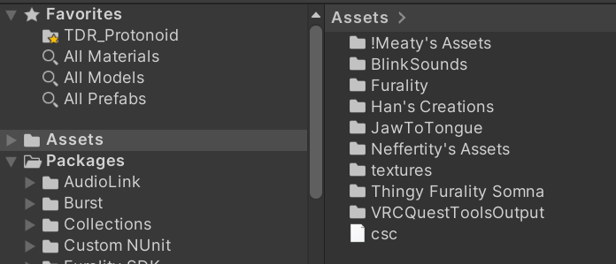
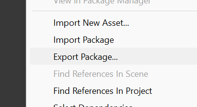
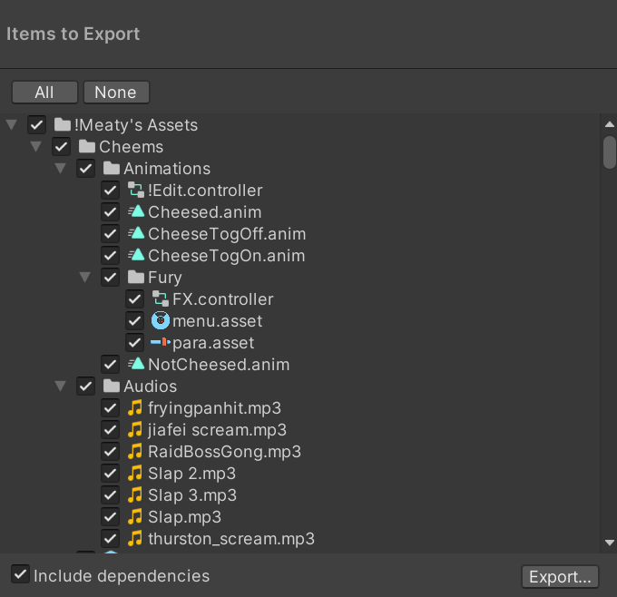

# Unity Packages

*Let me send my avatar to the artist!*

Ever wondered how avatar and asset makers make one quick, importable file for transferable purposes? You've come to the right place!

What are the benefits of Unity Packages?

### 1. Smaller file size
    - Unity packages, as opposed to regular .ZIPs, can include only the necessary data needed to be sent for a project to be replicated on another device.
### 2. Control over what's sent
    - As the exporter, you can choose *exactly* what you wont or don't want to send in the package. You can choose just to send over the FBX and the scene files in case you don't want the materials to be overwritten on their device, or includ eeverything to make sure it's a 1:1 experience for the artist to work in tandem. 
### 3. Overwritable comptibility
    - If a Unity package is sent your way with intention that it will overwrite parts of your project, the package can overwrite only specific things, like the scene in case things are set up in a particular way, or chanigng materials around. It's modular!
:::warning

This process is irreversible, and cannot be undone. Use with caution, or backup your files to ensure you don't lose important data!

:::
    

## Instructions

### 1. Setup
Ensure your project is up-to-date, and includes everything you want to send over. If some of your dependencies exist as separate Unity packages, let the other person know.

:::info

A **dependency** is a separate asset, script, or program that is required for the project to function as intended.

:::

### 2. Process
While in our project, ensure you are looking inside the **Assets** folder of your project, right click the empty space inside, and select **Export Package...**.
  - If you only want to export a specific folder, right-click the folder of choice and then select **Export Package...**.

### 3. Selection
A window will appear that gives you the liberty to select exactly which files will be shared, as well as any dependencies if you are in a specific folder. If you don't know if you should export with dependencies, do so just in case!

After everything you'd like is selected, hit **Export**, and designate a package location like your desktop for convenience. Depending on the size of your project, exporting might take a while. Please be patient!

### You're done!
Send this file directly, as long as the end user owns the base model and any dependent assets! Have fun!