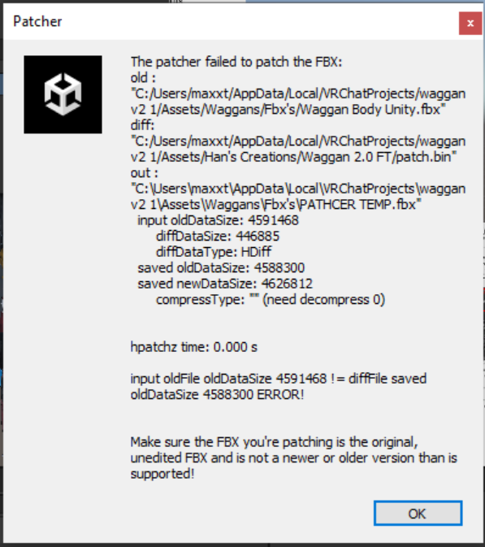
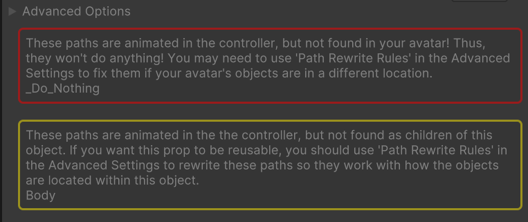

## Oh no, something is broken!

Let's make sure that there isn't an error on your end. If not, you can create a support ticket in my [Discord server](https://discord.gg/hantnor).

  
Patcher

  
### DiffSize Error

If you get this error, you may have an out-of-date FBX file. Verify you have the latest/most compatible version by comparing your version with the original seller's latest version.

If they match, make sure your FBX is **unedited**.

If your FBX is the proper one, and the patch still fails, make a support ticket in my [server](https://discord.gg/hantnor) under the #ticket-requests channel, and mention you got a **DiffSize** error. 

  
Unity Setup

    
No templates in project

### Unable to find Jerry's Template in your project
If you can't progress onto [this](https://hantnor.github.io/HanDocs/docs/Face%20Tracking/Beginner/PatchGuide#3-add-the-fx) stage, you may be forgetting to grab [**Adjerry's Face Tracking Templates**](https://github.com/Adjerry91/VRCFaceTracking-Templates). These are crucial for most patchers to work!

*You may have luck with other templates if you prefer how they work, but Jerry's are the most common.*

    
VRCFury Disclaimers

If you import your VRCFury prefab onto your avatar and you get these messages, **disregard them**! 9 times out of 10, it's benign. 

If it doesn't work, try any of these potential fixes:
- Close and reopen your project
- Upload avatar under a new blueprint ID
- Create a new project (last resort!)

*This could very well be a new bug with a recent VRCFury update. I'm not sure about it yet!*

    
In-Game

    
Face frozen forward

    
### Cannot see FT working in-game
You may have to reset your **VRChat OSC Cache**. More info [here](https://docs.vrcft.io/docs/vrcft-software/vrcft#resetting-vrchat-osc-configs). 

The reason you have to do this is because when you initially load an avatar, VRCFT makes a “mental note” if it has FT parameters or not, and then saves it. Once it has written down if it has/doesn’t have it, then it won’t recheck, even if the avatar is updated with FT later on.  

If you clear the history, then it will check again. It will rewrite the config to say that the avatar has FT installed, and will remember that.

***It's good practice to have a fresh first-time upload for a FT-compatible avatar!***

    
No FT menu in Expressions wheel

You may have forgotten to include a template prefab into your avatar. Make sure you applied it!

